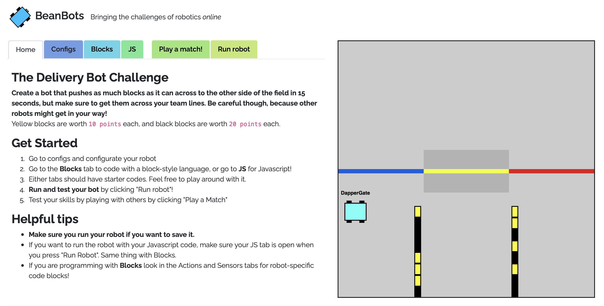

# Beanbots

Amid the COVID19 pandemic, many robotics competitions, along with the valuable in-person experience of learning to design a robot, building it, and bringing it to life with code, have all come to a halt. **Beanbots** was created to attempt to revive some parts of this experience through an online format: coding the robot.

With Beanbots, users will learn to configure the robot and attach different parts to the robot, and will learn to make the robot move around with either a Scratch/Block-like language or Javascript to perform tasks and complete challenges. The users can also "battle" against other bots and learn new and perhaps more efficient ways to solve the challenge from each other.

